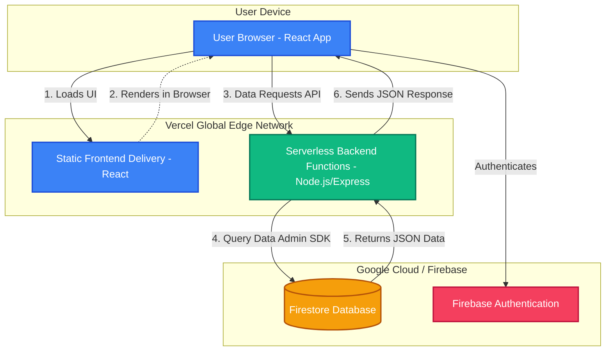

# System Architecture Overview

This document outlines the logic and data flow of the MDMS application.

## High-Level Architecture Flow

The system is a unified full-stack application hosted on Vercel, integrating securely with Google Cloud Firebase.

## System Logic and Data Flow

### 1. The Frontend (React UI)
- The React frontend is served globally via Vercel’s Edge Network. 
- When a user visits the application URL, the browser downloads the static bundle (HTML/CSS/JS) and renders the interface locally.
- Authentication happens directly between the React frontend and Firebase Authentication.

### 2. The Backend (Serverless API)
- The backend logic is powered by Node.js/Express and is structured inside the `/api` directory.
- Vercel automatically maps any file inside `/api` into a Serverless Function. 
- The `vercel.json` rewrite rules ensure that frontend requests to `/api/*` are intercepted and routed to these serverless functions seamlessly without hitting the React router.
- When an API request is made, a serverless instance spins up dynamically, processes the logic, and shuts down immediately after sending the response.

### 3. Database Interaction (Firestore)
- The Serverless backend interacts with the Firestore Database using the `Firebase Admin SDK`.
- Secure connection to Firebase is established using a service account credentials object stored safely within Vercel's Environment Variables (`FIREBASE_SERVICE_ACCOUNT`).
- Data queried from Firestore is parsed, formatted into JSON, and returned back down the chain to the React frontend where it populates the UI state.

### 4. Security and Authentication Flow
- All API routes are protected by a global `checkAuth` Express middleware (`api/routes/api.js`).
- When a user logs in, Firebase Authentication issues a JWT (JSON Web Token). The frontend stores this token in `localStorage`.
- For every subsequent API request (GET, POST, PUT), the frontend retrieves this token and appends it to the request headers (`X-Authorization: Bearer <token>`).
- The backend intercepts the request and verifies the JWT using the `Firebase Admin SDK` (`admin.auth().verifyIdToken()`).
- If the token is valid, the request proceeds to the Firestore data fetch logic. If missing or invalid, it immediately returns a `401 Unauthorized` response.
