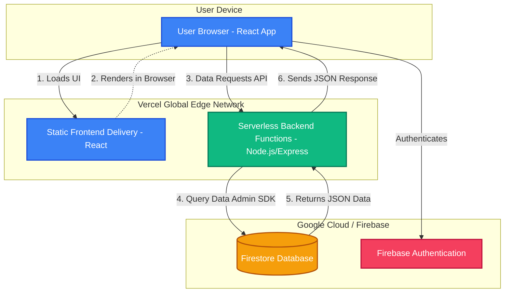

# System Architecture Overview

This document outlines how your application is currently structured following the migration to Vercel and Serverless Functions.

## High-Level Architecture

Your system is now a modern, unified, full-stack application hosted entirely on Vercel, integrating securely with Google Cloud Firebase. 

## How It Works

### 1. The Frontend (React on Vercel)
- When a user visits `https://mdms-fe.vercel.app`, Vercel’s Global Edge Network immediately serves the optimized React static files. 
- The browser downloads this bundle and the React app runs on the user's machine.

### 2. The Backend (Vercel Serverless Functions)
- Previously, you had a separate Node.js server running 24/7 on Render (`mdms-backend-ymsu.onrender.com`).
- We migrated this into a **Serverless Architecture** by moving your Express API logic into the `/api` folder of your React repository.
- Vercel automatically detects the `/api` folder and turns each file into a secure, on-demand serverless function. 
- When the frontend makes an API call (e.g., fetching devices), Vercel spins up a lightweight server instance for a few milliseconds, processes the request, returns the data, and then shuts it down. This is **free, blazing fast, and scales infinitely**.

### 3. Database & Security (Firebase)
- The Serverless backend connects securely to Firebase Firestore using the `Firebase Admin SDK`.
- We stored your `serviceaccountkey.json` credentials securely inside Vercel's Environment Variables (`FIREBASE_SERVICE_ACCOUNT`). This prevents the key from being exposed in your source code while allowing the backend full access to your database.

### 4. Routing
- The `vercel.json` file handles **rewrites**, ensuring that any request starting with `/api/` is sent directly to your serverless backend, bypassing the React router. 

### Why is this better than the old Render setup?
* **Zero Cold Starts**: No waiting 50 seconds for Render to wake up from its free-tier sleep.
* **Unified Codebase**: Frontend and backend live in the same repository, making it easier to manage.
* **No CORS Issues**: Because the React app and the API share the same domain (`mdms-fe.vercel.app`), browser security restrictions (CORS) are no longer a headache.
* **Cost Effective**: Vercel's generous free tier fully supports serverless functions without requiring a paid plan like Firebase Cloud Functions (Blaze plan) would have.
